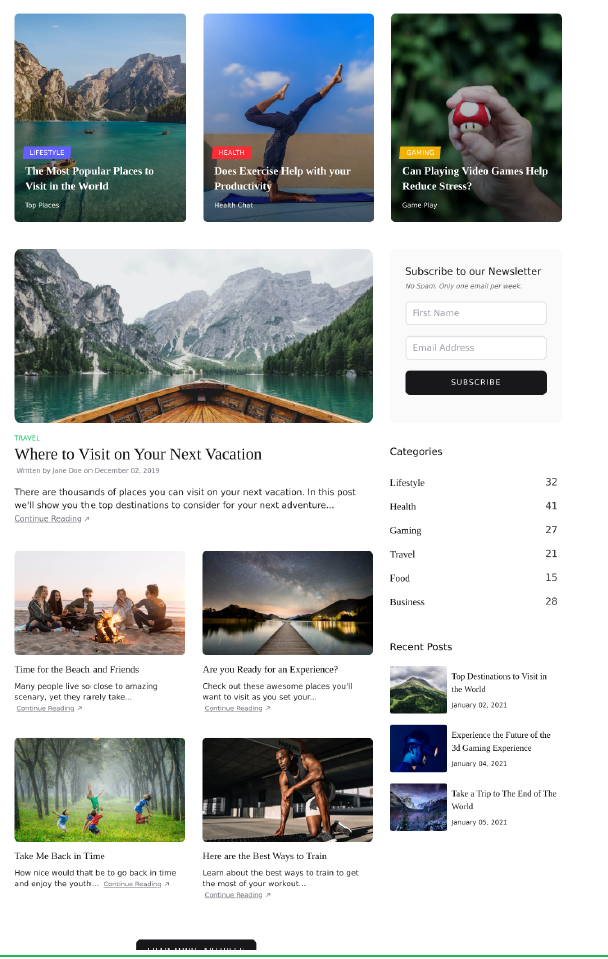
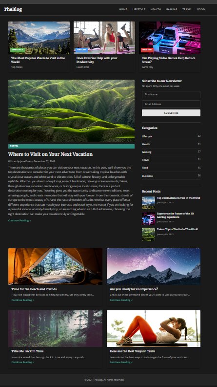

# Tarea 1 — Clon de Sección de Sitio Web

**Curso:** Multimedios  
**Autor:** Aaron Salazar Mata  
**Carné universitario:** C37190  
**Institución:** Universidad de Costa Rica

---

## Comandos de ejecución

Este proyecto no requiere ningún framework ni proceso de build. Es HTML y CSS puro.

### Opción 1 — Abrir directamente en el navegador

```bash
# Navega a la carpeta del proyecto
cd tarea1_multimedios/src

# Abre el archivo directamente en tu navegador
# Windows:
start index.html

# macOS:
open index.html

# Linux:
xdg-open index.html
```

### Opción 2 — Servidor local con VS Code

1. Instala la extensión **Live Server** en VS Code
2. Abre la carpeta `src/` en VS Code
3. Clic derecho sobre `index.html` → **"Open with Live Server"**
4. El sitio estará disponible en `http://127.0.0.1:5500`

### Opción 3 — Servidor local con Node.js

```bash
# Instala http-server si no lo tienes
npm install -g http-server

# Desde la carpeta src/
cd tarea1_multimedios/src
http-server -p 3000

# Abre http://localhost:3000 en tu navegador
```

---

## Estructura del proyecto

```
tarea1_multimedios/
└── src/
    ├── index.html      # Estructura semántica del sitio
    ├── index.css       # Estilos externos (sin style="" ni <style>)
    ├── index.js        # Archivo JS (vacío, reservado)
    └── img/
        ├── montanas.jpg    # Tarjeta Lifestyle + Recent Post
        ├── yoga.jpg        # Tarjeta Health
        ├── gaming.jpg      # Tarjeta Gaming + Recent Post
        ├── lago-bote.jpg   # Artículo destacado + Recent Post
        ├── fogata.jpg      # Grid — Time for the Beach
        ├── carretera.jpg   # Grid — Ready for an Experience
        ├── bosque.jpg      # Grid — Take Me Back in Time
        └── atleta.jpg      # Grid — Best Ways to Train
```

---

## Decisiones en el HTML Semántico

El HTML se estructuró usando exclusivamente etiquetas semánticas de HTML5. Cada etiqueta fue elegida con base en el **significado del contenido**, no en su apariencia visual.

### `<header>` y `<nav>`

Se usó `<header>` para envolver la barra de navegación del sitio porque representa el encabezado global de la página. Dentro, `<nav>` identifica explícitamente el bloque de enlaces de navegación principal. Esto es fundamental para lectores de pantalla, que saltan directamente al `<nav>` cuando el usuario quiere orientarse dentro del sitio.

### `<main>`

Todo el contenido central de la página se envuelve en `<main>`. Esta etiqueta le indica tanto al navegador como a tecnologías de asistencia que ese es el contenido único y principal del documento, descartando header, footer y sidebar repetitivos.

### `<section>`

Se usaron tres `<section>` diferenciadas con `aria-label`:
- `"Artículos destacados"` — las 3 tarjetas superiores
- `"Artículo principal y sidebar"` — el artículo grande + barra lateral
- `"Más artículos"` — la cuadrícula de 4 tarjetas inferior

Cada `<section>` agrupa contenido temáticamente relacionado que, en conjunto, forma una parte identificable de la página.

### `<article>`

Se usó `<article>` para cada tarjeta de contenido editorial (noticias, posts). La razón: un `<article>` es contenido que podría existir de forma independiente fuera del sitio, como una entrada de blog o una noticia. Si extraes la tarjeta y la publicas sola, sigue teniendo sentido.

### `<aside>`

La barra lateral usa `<aside>` porque su contenido (newsletter, categorías, posts recientes) es complementario al artículo principal, pero no esencial para entenderlo. Es exactamente el caso de uso semántico que define la especificación HTML5 para esta etiqueta.

### ``

Cada imagen tiene un atributo `alt` descriptivo y detallado. Esto cumple dos funciones: accesibilidad para usuarios con discapacidad visual, y fallback de texto si la imagen no carga.

### `<time datetime="...">`

Las fechas de los posts recientes usan `<time>` con el atributo `datetime` en formato ISO (`2021-01-02`). Esto permite que motores de búsqueda y aplicaciones de calendario lean la fecha correctamente, aunque el texto visible tenga otro formato.

---

## Decisiones en el CSS

### Variables CSS (`:root`)

Todos los colores, fuentes, radios y sombras se definen como variables en `:root`. Esto centraliza el sistema de diseño: si el color de acento cambia, se modifica en un solo lugar y se propaga a todo el sitio.

```css
:root {
  --color-acento: #3a9e8f;
  --fuente-titulos: 'Merriweather', Georgia, serif;
}
```

### Tipografía con Google Fonts

Se eligieron dos fuentes complementarias:
- **Merriweather** (serif) para títulos y el logo — da un tono editorial y de revista, similar al diseño original.
- **Open Sans** (sans-serif) para el cuerpo de texto, párrafos y UI — garantiza legibilidad en cualquier tamaño de pantalla.

### CSS Grid para los layouts de sección

Se usó `display: grid` en los tres layouts principales porque Grid es la herramienta correcta para estructuras **bidimensionales** (filas y columnas simultáneas):

- **`seccion-tarjetas-top`**: `repeat(3, 1fr)` → 3 columnas iguales
- **`seccion-contenido`**: `1fr 320px` → artículo flexible + sidebar fijo
- **`seccion-grid`**: `repeat(2, 1fr)` → cuadrícula 2×2

### Flexbox para componentes internos

Se usó `display: flex` dentro de los componentes (tarjeta, post reciente, nav, formulario) porque Flexbox es ideal para layouts **unidimensionales**: apilar elementos en columna o alinearlos en fila con control fino del espaciado.

### `@media` con sintaxis de rango

Se utilizó la sintaxis moderna de rangos para las media queries, más legible que la sintaxis clásica con `min-width`/`max-width`:

```css
/* Moderno — rango explícito */
@media (640px <= width <= 1024px) { }

/* Equivalente clásico — menos legible */
@media (min-width: 640px) and (max-width: 1024px) { }
```

### `@media (prefers-color-scheme: dark)`

Se implementó modo oscuro automático mediante variables CSS. Al sobreescribir las variables de color en este bloque, todo el sitio cambia de tema sin duplicar reglas ni usar JavaScript.

### `@media (hover: hover) and (pointer: fine)`

Los efectos de elevación en tarjetas (`:hover`) solo se activan en dispositivos con ratón. En dispositivos táctiles no existe el "pasar el mouse", por lo que aplicar `:hover` causaría que la tarjeta quedara "elevada permanentemente" al tocarla.

### `@media (prefers-reduced-motion: reduce)`

Por accesibilidad, todas las transiciones y animaciones se desactivan si el usuario tiene configurado en su sistema operativo que prefiere movimiento reducido (común en personas con epilepsia o sensibilidad al movimiento).

### `@supports not (display: grid)`

Se agregó un bloque de fallback con Flexbox para navegadores muy antiguos que no soporten CSS Grid. Esto asegura que el contenido sea visible aunque sin el layout ideal.

### `@container` queries

Se usaron Container Queries para que las imágenes de las tarjetas reduzcan su altura en función del **tamaño de su contenedor padre**, no de la ventana del navegador. Esto es más preciso: una tarjeta puede ser angosta dentro de un grid ancho, y la media query de ventana no lo detectaría.

### Decisión de especificidad (cascada)

Las clases de color de etiquetas (`.etiqueta-lifestyle`, `.etiqueta-health`, etc.) se declaran **después** de `.etiqueta` en el archivo. Tienen la misma especificidad, pero al estar más abajo en la cascada, sobreescriben el color sin necesidad de `!important`. Esto demuestra comprensión consciente de cómo funciona la cascada en CSS.

---

## Comparación: Diseño original vs. Resultado

### Similitudes logradas

| Elemento | Original | Resultado |
|---|---|---|
| 3 tarjetas superiores con imagen y etiqueta de categoría | ✅ | ✅ |
| Etiquetas de color por categoría (Lifestyle, Health, Gaming, Travel) | ✅ | ✅ |
| Artículo destacado con imagen grande, categoría, título, autor y extracto | ✅ | ✅ |
| Enlace "Continue Reading ↗" en teal/verde | ✅ | ✅ |
| Sidebar con formulario de newsletter (First Name, Email, SUBSCRIBE) | ✅ | ✅ |
| Lista de categorías con conteo numérico a la derecha | ✅ | ✅ |
| Sección Recent Posts con thumbnail + título + fecha | ✅ | ✅ |
| Cuadrícula 2×2 de tarjetas con imagen, título, extracto y "Continue Reading" | ✅ | ✅ |
| Footer con copyright | ✅ | ✅ |
| Tipografía serif para títulos | ✅ | ✅ |

### Diferencias y mejoras

| Aspecto | Original | Resultado |
|---|---|---|
| **Responsive** | No especificado | ✅ Adaptable a tablet y mobile |
| **Modo oscuro** | No tiene | ✅ Automático via `prefers-color-scheme` |
| **Accesibilidad** | No especificado | ✅ `aria-label`, `alt`, `<time>`, `role` semántico |
| **Fuentes** | No especificado | ✅ Merriweather + Open Sans (Google Fonts) |
| **Header/Nav** | No visible en la imagen | ✅ Añadido con enlaces de navegación |
| **Imágenes** | URLs externas (CDN) | ✅ Descargadas localmente en `src/img/` |
| **Hover en tarjetas** | No especificado | ✅ Elevación suave solo en dispositivos con mouse |

**Screenshot del sitio original**: 


**Screenshot del sitio clon**: 

---

*Tarea 1 — Multimedios — Universidad de Costa Rica — 2026*
